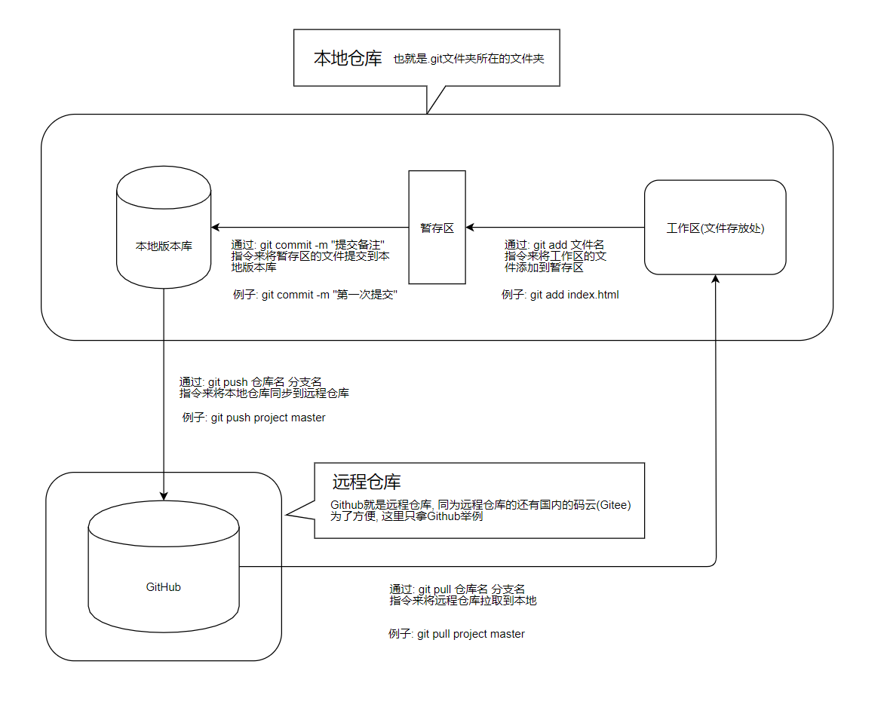

# Git相关笔记
## Git创建和Github绑定流程

<iframe id="embed_dom" name="embed_dom" frameborder="0" style="display:block;width:525px; height:245px;" src="https://www.processon.com/embed/5de4c89ce4b0b2fab7408db5"></iframe>

点击查看链接 [Git创建和Github绑定流程](https://www.processon.com/view/link/5de4c89de4b0e2c2989ab344)

## Git工作流程
